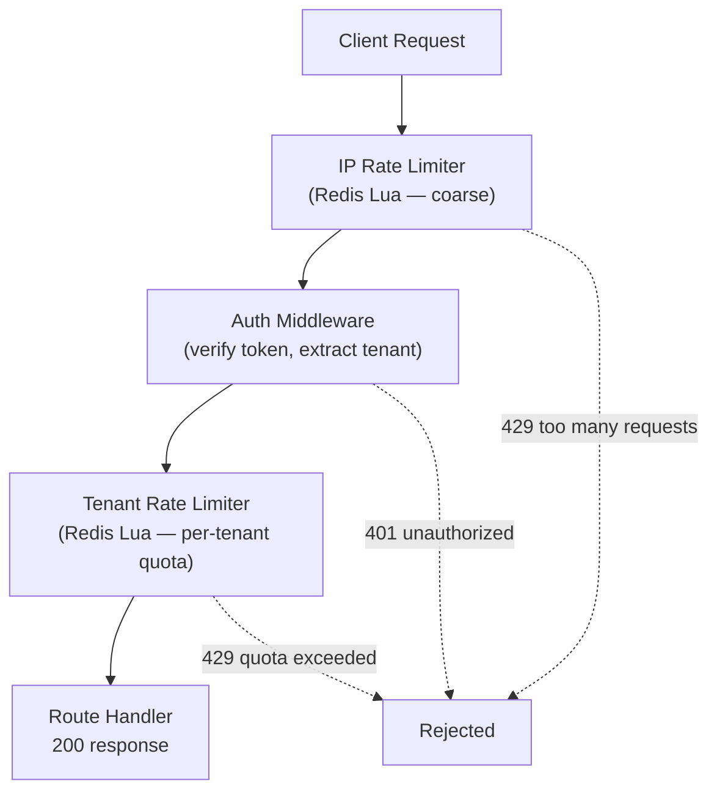

# Redis Rate Limiter & API Gateway

[](https://www.npmjs.com/package/@devakhil/redis-rate-limiter)
[](./LICENSE)

A distributed, Redis-backed rate limiter that stays correct under concurrent load — not just in theory, but proven with a load test across multiple horizontally-scaled instances.

## Why this exists

Rate limiting is a staple of system design interviews, but there's a real gap between describing "token bucket vs. sliding window" on a whiteboard and actually implementing the atomicity guarantee that makes either one correct once more than one server instance is involved. This repo is that gap, closed: a real implementation, a real race condition it prevents, and a real load test proving it.

## Architecture



Every rate-limit check is a single atomic Redis operation (`EVALSHA` running a Lua token-bucket script) — reading the bucket, refilling it based on elapsed time, deciding allow/deny, and writing the new state back all happen as one indivisible step. That's what keeps the limit correct even when several gateway instances hit the same key at the same time.

> **Known architectural limitation:** in `demo-api`, the limiter is wired in as Express middleware, applied per route. That's the fastest way to prove the algorithm works, but it's not where this belongs in a production system — it should sit at the API gateway layer, as a single enforcement point in front of everything, rather than duplicated per route or per service. Moving it there is the next milestone (see [Roadmap](#roadmap)).

## Repo structure

```
redis-rate-limiter/
├── packages/
│   ├── limiter/          # published npm package — the rate limiter core
│   │   ├── src/
│   │   ├── package.json
│   │   └── README.md
│   └── demo-api/         # reference Express app using the limiter
│       ├── src/
│       ├── package.json
│       └── README.md
├── package.json          # workspace root
├── tsconfig.base.json
└── README.md              # you are here
```

## Packages

### [`@akhil173/redis-rate-limiter`](https://www.npmjs.com/package/@devakhil/redis-rate-limiter) — `packages/limiter`

The published, standalone package. Redis-backed, atomic, token-bucket rate limiting middleware for Express — usable in any Node.js project, not just this one.

```bash
npm install @devakhil/redis-rate-limiter ioredis express
```

Full API and usage docs: [`packages/limiter/README.md`](packages/limiter/README.md)

### `demo-api` — `packages/demo-api`

Reference implementation showing the package used in a real app: layered IP + tenant rate limiting, auth middleware, and Redis-backed per-tenant quota config with in-process caching.

Setup and routes: [`packages/demo-api/README.md`](packages/demo-api/README.md)

## Quick start (whole repo)

```bash
git clone https://github.com/akhil173/redis-rate-limiter.git
cd redis-rate-limiter
docker run -d --name redis-dev -p 6379:6379 redis:7-alpine
npm install                          # wires up workspace symlinks for both packages
npm run build --workspace=packages/limiter
npm run dev --workspace=packages/demo-api
```

## Key technical highlights

- **Atomic by construction** — the entire check-and-update happens inside a single Lua script executed via `EVALSHA`, eliminating the race condition a naive `GET`-then-`INCR` approach has across multiple instances
- **Proven under concurrency** — verified with a k6 load test across 3 replicas behind Nginx: the combined request rate held to the configured limit, not 3x it
- **Layered defense** — coarse IP-based limiting before authentication (protects auth logic itself from being hammered), precise tenant-based limiting after
- **Real multi-tenancy** — per-tenant quotas stored in Redis, not hardcoded, with a short in-process cache to avoid doubling Redis load per request
- **Published as a reusable package** — the core logic is decoupled from this specific demo app and installable independently

## Roadmap

- [ ] Migrate rate limiting from per-route middleware to a true API gateway layer
- [ ] `/metrics` endpoint (Prometheus) + basic Grafana dashboard
- [ ] Sliding-window-log mode as an alternate algorithm, with a comparison writeup
- [ ] Redlock-based distributed lock for safe tenant-config hot-reload
- [ ] Auto-recovery from `NOSCRIPT` errors after a Redis restart

## License

MIT — see [LICENSE](./LICENSE)